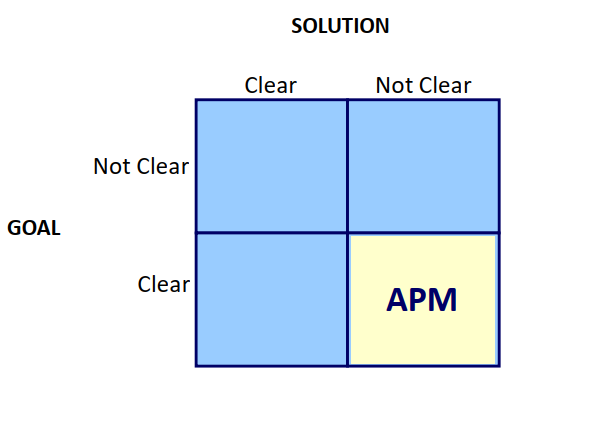
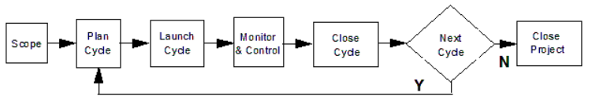

# Descrizione dell'approccio utilizzato per la fase di Scoping

Per la fase di scoping abbiamo seguito la struttura del Project Overview Statement (POS) per analizzare e descrivere 
i deliverables del progetto. Dopo una breve dichiarazione dell'obiettivo principale del progetto, siamo partiti
col definire, tramite brainstorming, i requisiti funzionali e non funzionali da sviscerare con uno studio più dettagliato.
Per quanto riguarda la gestione di questi requisiti, abbiamo scelto di adottare la metodologia Agile Scrum, quindi di sfruttare in pieno lo sviluppo con continua interazione con gli utenti (o gruppi selezionati di possibili utenti) e suddividendo le funzionalità rilasciate in release specifiche: questa decisione è stata presa in quanto, essendoci immedesimati una startup "appena nata", e non avendo alcun prodotto in mercato, abbiamo ritenuto migliore lo sviluppo in release successive basate sul loro stesso livello di gradimento nel mercato e tra gli utenti, in modo da limitare il rischio e aumentare l'esperienza dell'utente.
Le release sono numerate per ordine numerico crescente, ciascuno con:
- Obiettivi da implementare: una lista di requisiti che formeranno il prototipo da rilasciare al pubblico, che si intendono obbligatori
- Criteri di successo: una lista di criteri e deadline da rispettare per ritenere compiuto in modo positivo il rilascio della release corrente e il suo macro obiettivo
- Pre-Condizioni: come i criteri di successo, si riferiscono a una lista di criteri necessarie, basate sull'ultima release, per dar senso al proseguimento del progetto con la release successiva

Per quanto riguarda le Assunzioni/Ostacoli abbiamo seguito un classico approccio elencando le assunzioni di base, sia a livello di team (ad esempio skill necessarie), sia di natura economica che tecnica. Per quanto riguarda gli ostacoli, partire dal nulla già di per sé rappresenta un rischio, quindi gli ostacoli maggiori sono offerti dal mercato esistente e basati su tutto l'ampio spettro di conoscenze e aspetti tecnici/economici (come privacy, performance...) richieste per entrare nel mercato, quindi ad esempio regolamenti e protocolli a cui allinearsi.

Come detto, un aspetto fondamentale è rappresentato dal rischio: non possiamo sottovalutarlo, e un analisi accurata sui possibili rischi, il loro grado di impatto e la probabilità è necessaria per una startup, in modo da svolgere il proprio lavoro in sicurezza e consapevoli a cosa si va incontro.
Come è possibile vedere anche nella sezione apposita, ogni rischio è catalogato da uno score (in base alla sua gravità di impatto e probabilità), una descrizione, una classificazione della categoria di rischio, ovvero se tecnico, di organizzazione o relativo ad esterni. Infine il risk management, ovvero una o più possibili soluzioni per mitigare il rischio rappresentato. I rischi sono indicati con delle card colorate, in base al livello di gravità del rischio.

In quanto abbiamo scelto di adottare un approccio Agile, la metodologia di individuazione e suddivisione dei compiti è stata effettuata sfruttando le User Stories, che garantiscono una grande flessibilità, divise in:
- Theme (tema): una collezione di storie suddivise per categoria
- Epiche: una epica si riferisce ad una cosiddetta Big Story, un requisito troppo grande per essere sviluppato in un singolo sprint, per questo vengono suddivise in deliverables più piccoli, ovvero le singole user stories
- User Story: la user story identificata, che può essere riferita ad un requisito o un bisogno di un utente (fruitore del sistema o qualsiasi altro stakeholder legato ad esso)

Per quanto riguarda l'analisi SWOT, ovvero uno studio ad alto livello delle caratteristiche del progetto quali punti di forza o debolezze, abbiamo mantenuto lo schema originale dividendo in fattori esterni (opportunità e minacce) e fattori interni (punto di forza e debolezze). Tra queste spiccano per numero i punti di forza, data il carattere innovativo del progetto, ma anche le debolezze in quanto si parte con una startup senza esperienza nel settore e che non può svolgere attività troppo commerciali, non avendo abbastanza forza per aprire collaborazioni.
Rimangono più limitate le opportunità in quanto si fa riferimento a diverse municipalità e nazioni, ognuno con il proprio sistema di gestione dei servizi cittadini; stessa cosa per quanto riguarda le minacce, ovvero i fattori esterni che potrebbero incidere negativamente sul progetto, in quanto l'assenza di una primaria campagna pubblicitaria e la bassa monetizzazione iniziale potrebbero incidere in modo negativo sul budget disponibile e quindi sull'avanzamento del progetto.

Per analizzare gli elementi chiave del progetto, come ad esempio le attività principali, i possibili partner a cui mirare, costi e così via sono stati schematizzati sfruttando il cosiddetto template <b> Business Model Canvas </b>. Si noti che:
- Essendo la startup appena nata, tra le attività chiave si è scelto di focalizzare l'attenzione sull'applicazione delle più moderne e innovative tecniche e processi di sviluppo software, quali utilizzo del cloud, microservizi scalabili, DevOps e particolare attenzione al livello di soddisfazione e richieste degli utenti utilizzatori
- Per quanto riguarda la gestione dei costi, si è deciso di minimizzare inizialmente gli stipendi minimizzando il personale necessario, quindi ritardando l'avanzamento del progetto per poter devolvere il risparmio nei costi iniziali di infrastruttura e sviluppo

## Conseguenze dell'approccio Agile
Considerando l'aver scelto l'utilizzo dell'approccio Agile per l'analisi e lo sviluppo del progetto, possiamo catalogare il tipo di progetto come <i> Agile Project Management </i>, in quanto essendo la natura del progetto stesso molto orientata al soddisfacimento delle richieste della community di utilizzatori, è ben noto il goal finale ma non la soluzione finale da implementare. Questo può appunto portare al cambiamento di alcuni componenti e requisiti in base ai feedback degli utenti, sfruttando le <i> release attuali </i> per ottenere suggerimenti per cambiare il processo di sviluppo delle successive.

Questo incide sul ciclo di vita del progetto, il cosiddetto PM Lifecycle, il quale si avvicina più al modello di tipo adattivo, con l'unica differenza che con la fase di planning possiamo cambiare una parte dello scope per aggiungere le richieste degli utenti che non erano state anticipate nella release attuale. Si noti che sono ammessi esclusivamente i cambiamenti dello scope che sono a basso impatto sul resto dell'analisi già effettuata: se l'impatto è rilevante, è necessario creare un nuovo progetto sulla base di quella attuale.

## Chiusura della fase di scoping
Infine, si è deciso di chiudere la fase di scoping usando l'attività di eventstorming, ovvero una riunione di brainstorming collaborativa, per definire il business domain partendo dalle User Story definite. Questo permette di usare il linguaggio specifico del dominio, definire gli attori che in esso svolgono operazioni, sistemi e opportunità (in parte già anticipati nelle User Story sotto forma di ruoli, azione e benefici).

