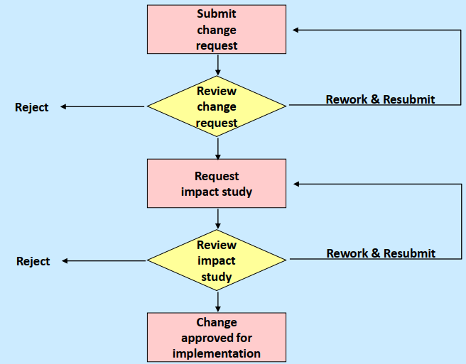

# Recruiting/Staffing
Dopo una serie di riunioni interne si è stilata una lista delle figure professionali richieste per lo sviluppo del progetto:
- <b>Project Manager</b>: è la figura che viene incaricata di gestire tutti gli aspetti del progetto e mantenere conformità con i vincoli esistenti, tenendo anchei in considerazione quelli temporali. Durante la fase di sviluppo, è incaricato anche con il ruolo di Scrum Master e Produc Owner, in quanto esperto del dominio
- <b>Backend Team</b>: Il core team è composto da 3 programmatori Junior (essendo una startup) che hanno comunque partecipato e/o hanno esperienza nella realizzazione di progetti a microservizi
- <b>Mobile Team</b>: il team di sviluppo è composto da 2 programmatori Junior che abbiamo conoscenza e un minimo di esperienza della programmazione mobile, che conoscano tecnologie Cross-Platform quali Flutter
- <b>Cloud Expert</b>: è stata identificata una figura necessaria che necessiterà di formazione e che avrà il ruolo di esperto della piattaforma cloud che verrà scelta come base per il progetto
- <b>Designer Team</b>: è composto da persone qualificate alla progettazione di grafiche intuitive e accattivanti e produzione di mockup. Potrebbe esser richiesto in outsourcing
- <b>Focus Group</b>: un gruppo di potenziali utenti, di dimensioni non troppo estese, alla presenza di uno o più moderatori, focalizzata su un argomento che si vuole indagare in profondità. Collabora con il Designer Team in quanto è vincolato dall'ottenimento delle grafiche

# Regole Operative
Una volta descritto il Project Team di partenza, si procede a definire le regole operative da seguire e soddisfare durante tutto il processo di sviluppo e coordinazione tra i team per raggiungere gli obiettivi proposti. Facciamo riferimento alla metodologia Agile SCRUM per le linee guida da adottare e da estendere con ulteriori vincoli a seconda delle nostre esigenze.

## Problem Solving
Per la risoluzione di eventuali problemi scaturiti durante il processo di sviluppo e testing degli artefatti prodotti si procede facendo riferimento ai <i> cinque passi </i> suggeriti da Daniel Couger, adattando la tecnica a 3 categorie (in parte riconducibili all'analisi effettuata sul Risk Management):
- Problemi a basso impatto: si discute il problema al meeting successivo, assicurandosi di avere un analisi adeguata circa il problema sorto, in modo che supporti adeguatamente uno scambio di idee (brainstorming) che porti alla risoluzione in breve tempo, ovvero entro il meeting pianificato
- Problemi con moderato impatto: si indice un meeting <b> straordinario </b> tra il team responsabile del task che ha generato il problema insieme al Project Manager, si analizza collettivamente il problema e si pianifica un meeting successivo per ragionare sulle soluzioni trovate
- Problemi ad elevato impatto: si indice un meeting <b> straordinario </b> tra il team responsabile del task che ha generato il problema insieme al Project Manager e nel momento di analisi, se lo si ritiene necessario, si cerca una consulenza esterna di uno sviluppatore senior esterno a cui verrà sottoposta un'analisi dettagliata del problema, chiedendo supporto e aiuto per la risoluzione (questi sono da considerare <b>costi extra</b>)

Vincoli di risoluzione dei problemi:
- Le soluzioni identificate per la risoluzione del problema non devono rimuovere funzionalità previste, ma possono pensare di rimodellare funzionalità già implementate, a patto che i vincoli e le procedure restino invariate
- Le soluzioni possibili sono discusse e analizzate per identificare la migliore, in base alla complessità e impatto sul codice. La soluzione più adeguata sarà poi implementata il più velocemente possibile
- Le decisioni sulle soluzioni da adottare vengono prese in modo partecipativo/collaborativo, in modo che ciascun membro del team possa essere coinvolto nel processo decisionale, favorendo una migliore sinergia del team

## Modalità di comunicazione
Per la comunicazione e gestione condivisa dei task, dei problemi (Issue) e la comunicazione dei cambiamenti necessari o fatti si utilizza il tool <i>Jira</i>, già applicato per l'organizzazione e il planning del Product Backlog, fornendo commenti utili alle comunicazioni riguardanti un preciso task. Ogni task è autonomo, salvo diversa precisazione (definite tramite dipendenze). Ci si aspetta che i commenti riguardino problemi legati alle dipendenze.

## Versioning
Per gestire la storia del progetto si utilizzano più repository GitHub (uno per l'applicazione e almeno uno per il backend, in caso di microservizi si usa un repository per microservizio e uno per raggrupparli tutti e testarli), integrato con il già citato tool <i>Jira</i>.
Lo sviluppo di un task corrisponde alla creazione di un nuovo branch di sviluppo dalla linea di sviluppo principale. Al meeting finale dello Sprint, viene esposto il lavoro svolto e, in accettazione positiva generale, sarà fatto <i>merge</i> del branch con la linea di sviluppo corrente.
Si mettono in campo tecniche di DevOps per test continui, in particolare ad ogni commit utilizzare procedure di verifica della qualità del codice oltre ai test di correttezza.

## Piano di qualità
Per mantenere una buona qualità del codice e documentazione si definiscono una serie di accorgimenti e strumenti da utilizzare in modo imperativo:
- Uso di Conventional Commits rigorosamente in lingua inglese
- Strumenti di analisi statica del codice, in modo da non introdurre warning e migliorare la leggibilità del codice in base alle convenzioni
- Utilizzo costante, strategico e non invasivo di commenti auto esplicativi, nonché di tool per generazione automatica della documentazione
- Rispettare i principi di buona programmazione tenendo sempre in considerazione i pattern e i principi standard di scrittura del codice (KISS; Single Responsibility ecc...)
- Si incoraggia uno sviluppo modulare e orientato al riuso di codice
- In base al risultato dei test automatici, stilare report di coverage, individuando 3 range di percentuale:
    - < 60%: non accettabile
    - tra 60% e 90%: buona coverage, specialmente nelle prime fasi del progetto
    - \> 90%: ottima coverage, da mantenere specialmente nelle ultime fasi del progetto
- Gestione automatica delle dipedenze e il loro aggiornamento, sfruttando strumenti di Build Automation

## Team Meetings
Come già descritto in fase di Planning (<a href="./scrum.html">link</a>), durante tutto il processo di sviluppo verranno tenute una moltitudine di meeting, ognuno con il proprio obiettivo da raggiungere.
Al termine di ciascuno Sprint (circa da 1 a 2 settimane massimo) viene effettuato uno Sprint Review Meeting, al quale è tenuto a partecipare tutti i team che hanno portato a termine dei task, in modo da aggiornare ogni membro dei progressi fatti e dar spazio a discussioni e analisi. Come detto, se si ha approvazione generale, le modifiche possono essere inserite nella linea di sviluppo principale.
Inoltre vengono analizzate le issue aperte ed eventualmente risolte/non risolte durante lo Sprint, creando nuove issue se ritenuto necessario dopo un analisi approfondita (evitando merge) o l'incontro di criticità in fasi successive di sviluppo.
Durante l'assegnazione dei task, nel caso vengano riscontrate criticità o la complessità risulta non banale, durante il meeting si suggeriscono alcune soluzioni che possano aiutare lo sviluppatore nel completamento del task.
Altrimenti, nel caso in cui uno o più sviluppatori non riescano a portare a termine i propri task assegnati entro la chiusura dello Sprint, sarà necessario che vengano riportati, durante il meeting, i motivi e le difficoltà che hanno portato a non rispettare la scadenza imposta, in modo che lo Scrum Master possa ripianificare l'assegnamento dei task ed eventuali issue da risolvere. Se necessario, vengono discusse in gruppo le problematiche al fine di essere più rapidi nel trovare soluzioni.

Inoltre, ogni mattina si prevede che ciascun membro del team si incontrino per un periodo massimo di 15 minuti, con l'obiettivo di pianificare la giornata lavorativa e discutere brevemente quella passata, includendo brevi discussioni dei risultati e/o problemi riscontrati e quali saranno le attività che si andranno a svolgere, ed eventualmente chiedere aiuto come già scritto sopra.

# Gestione dei cambiamenti di scope
Adottando una metodologia di sviluppo Agile, il cambiamento è sempre qualcosa che oltre ad essere accettato, viene incoraggiato. Per questo motivo, si incoraggia ciascun membro a portare a termine i propri assegnamenti in modo attivo, ragionando su possibili evoluzioni o miglioramenti, dando la possibilità di stilare un <b>Project Impact Statement</b> qualora si voglia sottoporre al team un possibile cambiamento. Questo documento va preparato e finalizzato con la collaborazione del Project Manager e discusso durante i meeting, rispondendo a domande generiche e precise su benefici e impatto del cambiamento (a livello di costi e tempi). I cambiamenti vengono anche presi dai suggerimenti e recensioni offerte dagli utenti e dal Focus Group.

Il processo tipico di gestione del cambiamento (Change Management) prevede un'iniziale invio dell'idea in modo formale al Project Manager, che con una veloce review può chiedere di rigettarla o di ampliare la proposta per un'ulteriore analisi durante il prossimo meeting, per valutare impatto e benefici. 

Il cambiamento, se approvato, dovrà essere inserito nel planning dei successivi task da svolgere, quindi sarà fondamentale da decidere in quale Sprint assegnarlo:
- Se il cambiamento è utile al raggiungimento dello Sprint Goal lo si inserisce nello Sprint attuale, riadattando i task e la quantità di lavoro assegnata
- Se il cambiamento porta ad un aumento effettivo del business value ma non risulta necessario per lo Sprint corrente, lo si postpone per una release successiva
- Se il cambiamento è urgente viene inserito nella Sprint attuale con maggiore priorità