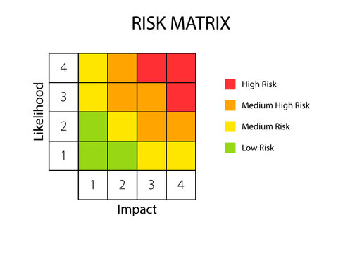

# Rischi
Per analizzare i rischi relativi al progetto, faremo riferimento alla seguente tabella Risk Matrix, che indica la probabilità (likelihood) che il rischio accada e l'eventuale impatto (impact) sul progetto che ne potrebbe conseguire.
Si identificano 4 livelli:
- High Risk: alta probabilità di rischio e impatto di notevole gravità. In questo caso è consigliata un'azione di correzione preventiva e repentina per evitare il rischio, riducendone la gravità dell'impatto o la probabilità
- Medium High Risk: rischio di tipo medio alto. Può succedere che il rischio in oggetto possa risultare in un impatto e probabilità mediamente alto
- Medium Risk: un rischio con contenuto impatto sul sistema e sul progetto, con probabilità da prendere in considerazione ma non vincolante
- Low Risk: bassa probabilità e basso impatto sul progetto, tale da ignorarne l'esistenza ma comunque da evidenziare e accettarne il rischio

